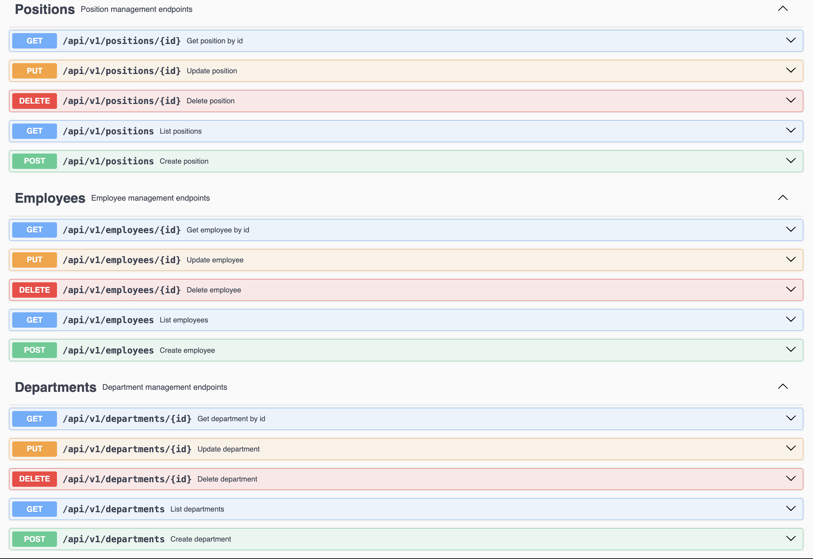
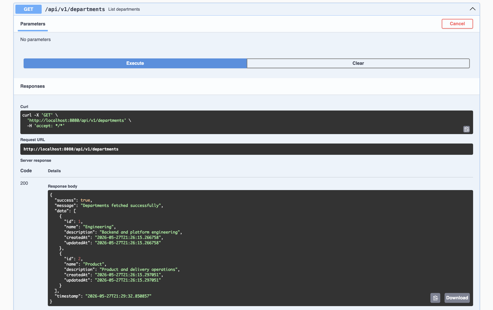
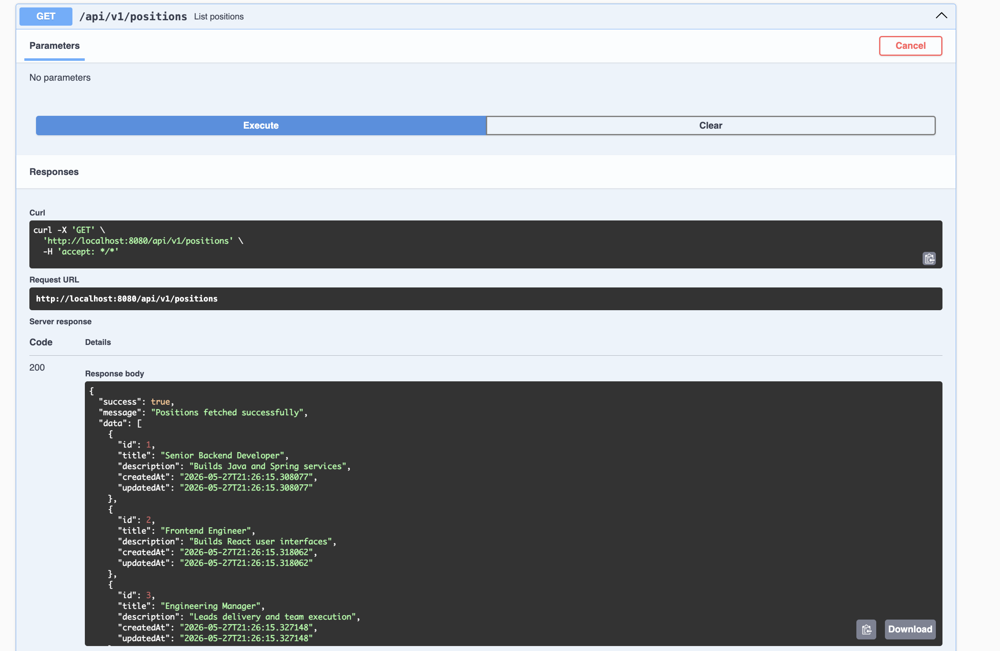
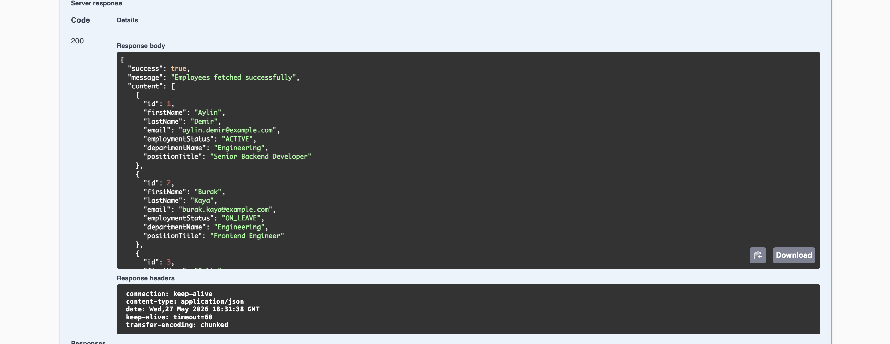
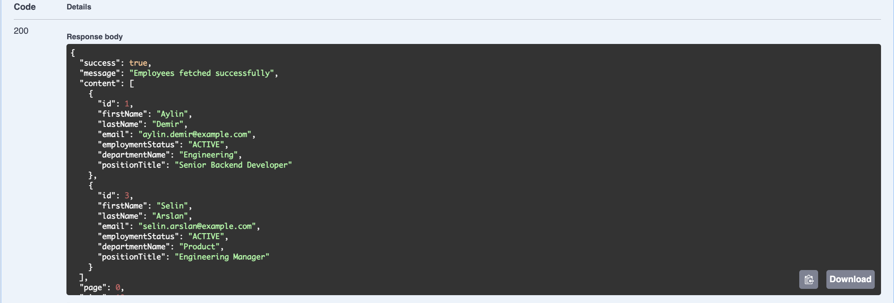

# Spring Employee Management API

Professional Spring Boot REST API for employee, department, and position management built to demonstrate clean backend architecture, PostgreSQL integration, validation, documentation, and Dockerized local setup.

## Overview

This project is a portfolio-ready backend application designed to demonstrate strong Spring Boot fundamentals with a clean and professional structure. It focuses on the parts recruiters and engineering teams expect to see in a real backend repository: layered architecture, DTO separation, validation, exception handling, PostgreSQL integration, Docker support, and API documentation.

The goal is to present a backend project that feels closer to a production-style codebase than a tutorial CRUD exercise.

## Tech Stack

- Java 21
- Spring Boot
- Spring Web
- Spring Data JPA
- PostgreSQL
- Bean Validation
- Lombok
- MapStruct
- Springdoc OpenAPI
- Docker
- Docker Compose

## Features

- Employee CRUD
- Department CRUD
- Position CRUD
- Pagination, sorting, and filtering for employees
- Request validation with Bean Validation
- Global exception handling
- Standard API response format
- Swagger / OpenAPI documentation
- Postman collection for endpoint verification
- Dockerized local development setup
- Maven Wrapper support
- Unit and integration test coverage

## Screenshots

### Swagger Overview



### Departments



### Positions



### Employees



### Filtered Employees



## Demo Walkthrough

Use Swagger or the included Postman collection to review the API quickly:

1. Open Swagger UI at `http://localhost:8080/swagger-ui/index.html`.
2. Run `GET /api/v1/departments` to confirm seeded departments.
3. Run `GET /api/v1/positions` to confirm seeded positions.
4. Run `GET /api/v1/employees` to review the employee response shape.
5. Run `GET /api/v1/employees?status=ACTIVE` to verify filtering.

## Architecture

This project follows a layered architecture and starts with a strong persistence foundation:

- `entity` for JPA models
- `repository` for database access
- `dto` for request and response models
- `service` for business logic
- `controller` for HTTP endpoints
- `exception` for global error handling
- `config` for application configuration

This structure keeps controllers thin, business rules in services, and persistence concerns in repositories. It also makes the project easier to explain during interviews and easier to extend later.

## Database Schema

Core entities:

- `Employee`
- `Department`
- `Position`

Relationships:

- one department has many employees
- one position can be assigned to many employees
- one employee belongs to one department
- one employee has one position

See [docs/database-schema.md](./docs/database-schema.md) for the initial schema direction.

## Sample Endpoints

- `GET /api/v1/departments`
- `POST /api/v1/departments`
- `GET /api/v1/positions`
- `POST /api/v1/positions`
- `GET /api/v1/employees`
- `GET /api/v1/employees/{id}`
- `POST /api/v1/employees`
- `PUT /api/v1/employees/{id}`
- `DELETE /api/v1/employees/{id}`

### Employee query parameters

- `page`
- `size`
- `sortBy`
- `sortDir`
- `departmentId`
- `positionId`
- `status`
- `search`

## API Documentation

Planned URLs after the application is running:

- Swagger UI: `http://localhost:8080/swagger-ui/index.html`
- OpenAPI JSON: `http://localhost:8080/v3/api-docs`
- Postman Collection: `./postman/spring-employee-management-api.postman_collection.json`

## Installation

### Prerequisites

- Java 21
- Maven 3.9+ or Maven Wrapper
- Docker and Docker Compose

### Clone the repository

```bash
git clone <repository-url>
cd spring-employee-management-api
```

### Configure environment variables

```bash
cp .env.example .env
```

### Run locally

```bash
./mvnw spring-boot:run
```

If you prefer a local Maven installation instead of the wrapper:

```bash
mvn spring-boot:run
```

## Environment Variables

| Variable | Description | Example |
|---|---|---|
| `DB_HOST` | PostgreSQL host | `localhost` |
| `DB_PORT` | PostgreSQL port | `5432` |
| `DB_NAME` | Database name | `employee_management_db` |
| `DB_USERNAME` | Database username | `postgres` |
| `DB_PASSWORD` | Database password | `postgres` |
| `SPRING_PROFILES_ACTIVE` | Active Spring profile | `dev` |

## Docker Setup

Run the application and PostgreSQL together:

```bash
docker compose up --build
```

Stop the stack when you are done:

```bash
docker compose down
```

Load demo data for screenshots and walkthroughs:

```bash
docker compose exec postgres psql -U postgres -d employee_management_db -f /app/scripts/demo-data.sql
```

See [docs/demo-data.md](./docs/demo-data.md) for the full walkthrough.

## Testing

Run the test suite with the Maven Wrapper:

```bash
./mvnw test
```

The project includes:

- service-level unit tests
- controller integration tests with H2 test profile
- Docker-based application verification

## Verification Status

This project has been verified with:

- successful Docker build
- successful Spring Boot startup
- successful PostgreSQL connection
- working Swagger / OpenAPI endpoint
- passing automated test suite

## What I Learned

This project helped reinforce:

- how to structure a professional Spring Boot API
- how to separate entities, DTOs, services, and controllers cleanly
- how to validate request payloads and return consistent error responses
- how to make a backend repository easier to run and review with Docker, Swagger, Postman, and tests

## Future Improvements

- Add database migrations with Flyway
- Add audit logging for entity changes
- Add more repository-level filtering tests
- Add CI workflow with GitHub Actions
- Add demo GIFs for the README

## Author

- Name: Ruhat Karatas
