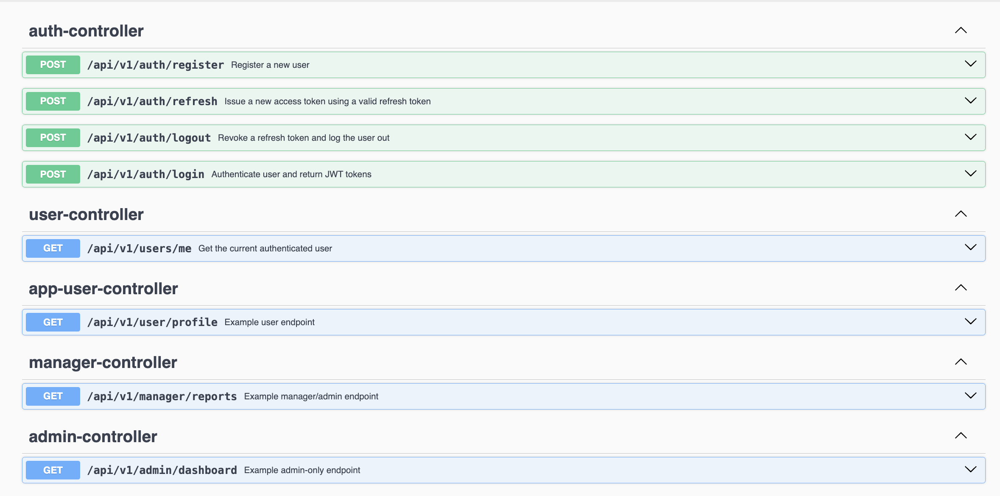
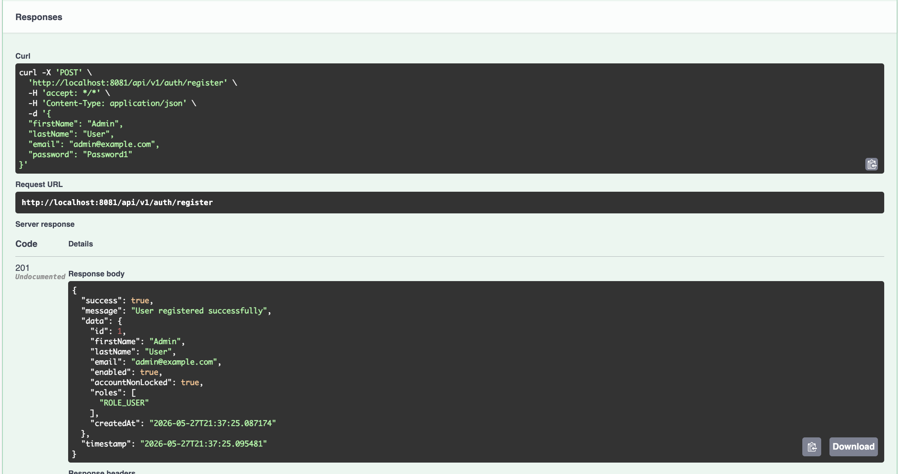
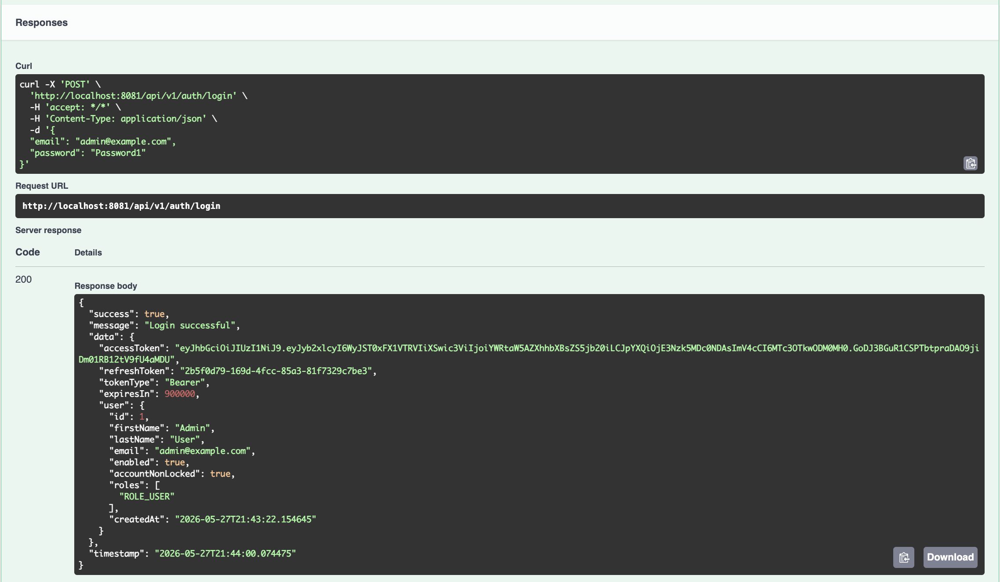
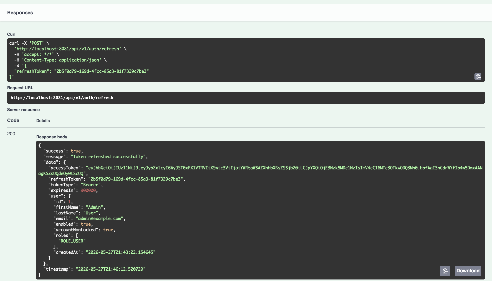

# spring-security-jwt-auth

## Overview

`spring-security-jwt-auth` is a focused authentication and authorization API built with Spring Boot. Its goal is to demonstrate practical Spring Security knowledge through JWT-based login, refresh token handling, role-based access control, PostgreSQL persistence, Swagger documentation, and Dockerized local development.

This project is intentionally scoped as a security foundation that can later be reused in larger fullstack systems.

## Tech Stack

- Java 21
- Spring Boot 3
- Spring Security
- Spring Data JPA
- PostgreSQL
- JJWT
- Bean Validation
- Swagger / OpenAPI
- Docker / Docker Compose
- Maven Wrapper

## Features

- User registration with validation
- Secure login with JWT access token generation
- Refresh token creation and token refresh endpoint
- Logout with refresh token revocation
- Role-based authorization with `ROLE_ADMIN`, `ROLE_MANAGER`, and `ROLE_USER`
- Protected endpoints for different authorization levels
- Current authenticated user endpoint
- Global exception handling with standard error responses
- PostgreSQL-ready configuration
- H2-backed integration tests for auth flow verification

## API Endpoints

### Public

- `POST /api/v1/auth/register`
- `POST /api/v1/auth/login`
- `POST /api/v1/auth/refresh`

### Protected

- `POST /api/v1/auth/logout`
- `GET /api/v1/users/me`
- `GET /api/v1/admin/dashboard`
- `GET /api/v1/manager/reports`
- `GET /api/v1/user/profile`

## Roles

- `ROLE_ADMIN`
- `ROLE_MANAGER`
- `ROLE_USER`

## Screenshots

### Swagger Auth Overview



### Register



### Login



### Refresh Token



## Demo Walkthrough

Use Swagger to review the core authentication flow:

1. Open Swagger UI at `http://localhost:8081/swagger-ui.html`.
2. Register a user with `POST /api/v1/auth/register`.
3. Log in with `POST /api/v1/auth/login` and copy the returned access token.
4. Use the refresh token with `POST /api/v1/auth/refresh`.
5. Authorize Swagger with the access token and call a protected endpoint.

Demo users can be prepared with [docs/demo-data.md](./docs/demo-data.md). The default demo password is `Password1`.

## Architecture

The project uses a layered backend structure:

- `controller` for HTTP endpoints
- `service` and `service/impl` for business logic
- `repository` for data access
- `entity` for JPA models
- `dto` for request and response contracts
- `security` for JWT and Spring Security integration
- `exception` for centralized error handling
- `config` for OpenAPI, security, and seed setup

## Authentication Flow

1. A user registers with first name, last name, email, and password.
2. The API validates input, hashes the password with BCrypt, and assigns the default `ROLE_USER`.
3. On login, Spring Security authenticates credentials.
4. The API returns a JWT access token and a persisted refresh token.
5. The refresh endpoint issues a new access token when the refresh token is valid.
6. Logout revokes the refresh token.

## Environment Variables

Copy `.env.example` into your own local environment configuration and provide values for:

- `DB_HOST`
- `DB_PORT`
- `DB_NAME`
- `DB_USERNAME`
- `DB_PASSWORD`
- `JWT_SECRET`
- `JWT_ACCESS_TOKEN_EXPIRATION_MS`
- `JWT_REFRESH_TOKEN_EXPIRATION_MS`

## Running Locally

### With Docker

```bash
docker compose up --build
```

The API is configured to run on:

- `http://localhost:8081`
- Swagger UI: `http://localhost:8081/swagger-ui.html`

### With Maven

```bash
./mvnw spring-boot:run
```

Default local API port:

- `http://localhost:8080`
- Swagger UI: `http://localhost:8080/swagger-ui.html`

## Demo Data

You can prepare demo users and role-based screenshots using the SQL notes in [docs/demo-data.md](./docs/demo-data.md) and the script in [scripts/demo-users.sql](./scripts/demo-users.sql).

## Testing

Run the test suite with:

```bash
./mvnw test
```

Current verification includes:

- integration test for register and login flow
- unauthorized access check for a protected endpoint

## Documentation

- OpenAPI config: [OpenApiConfig.java](./src/main/java/com/ruhatkaratas/authapi/config/OpenApiConfig.java)
- auth service: [AuthServiceImpl.java](./src/main/java/com/ruhatkaratas/authapi/service/impl/AuthServiceImpl.java)
- security config: [SecurityConfig.java](./src/main/java/com/ruhatkaratas/authapi/config/SecurityConfig.java)

## What I Learned

- how to structure a focused authentication API instead of mixing auth into a generic CRUD project
- how Spring Security authentication flow connects with JWT generation and request filtering
- how refresh token persistence and revocation work in practice
- how to design protected endpoints around authorization roles

## Future Improvements

- refresh token rotation
- stronger logout/session management
- email verification flow
- password reset flow
- integration tests for refresh and role-specific endpoints
- Postman collection for recruiter-facing documentation

## Author

**Bulent Ruhat Karatas**

- GitHub: [OropherCalanor](https://github.com/OropherCalanor)
