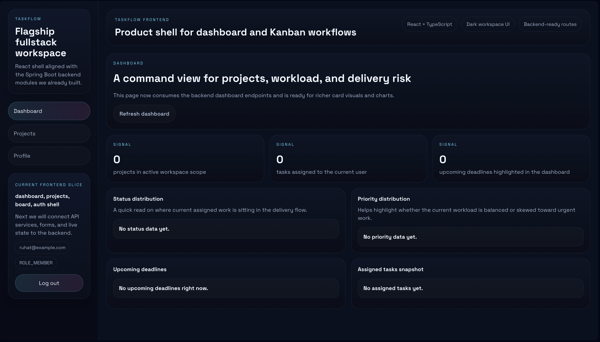
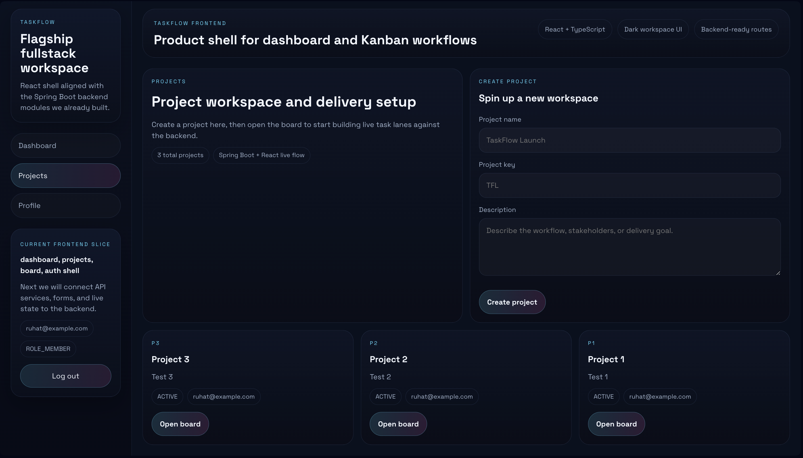
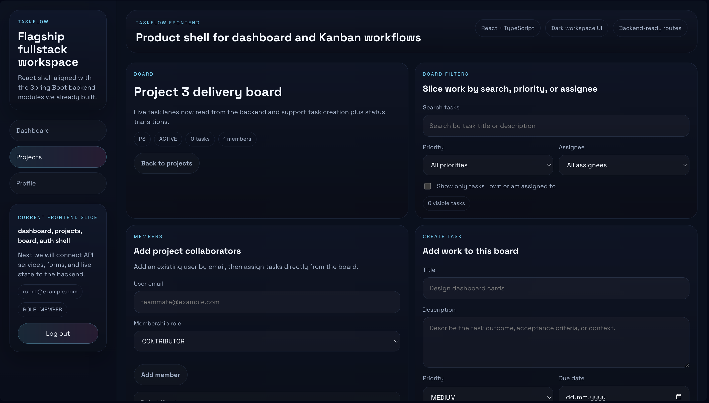
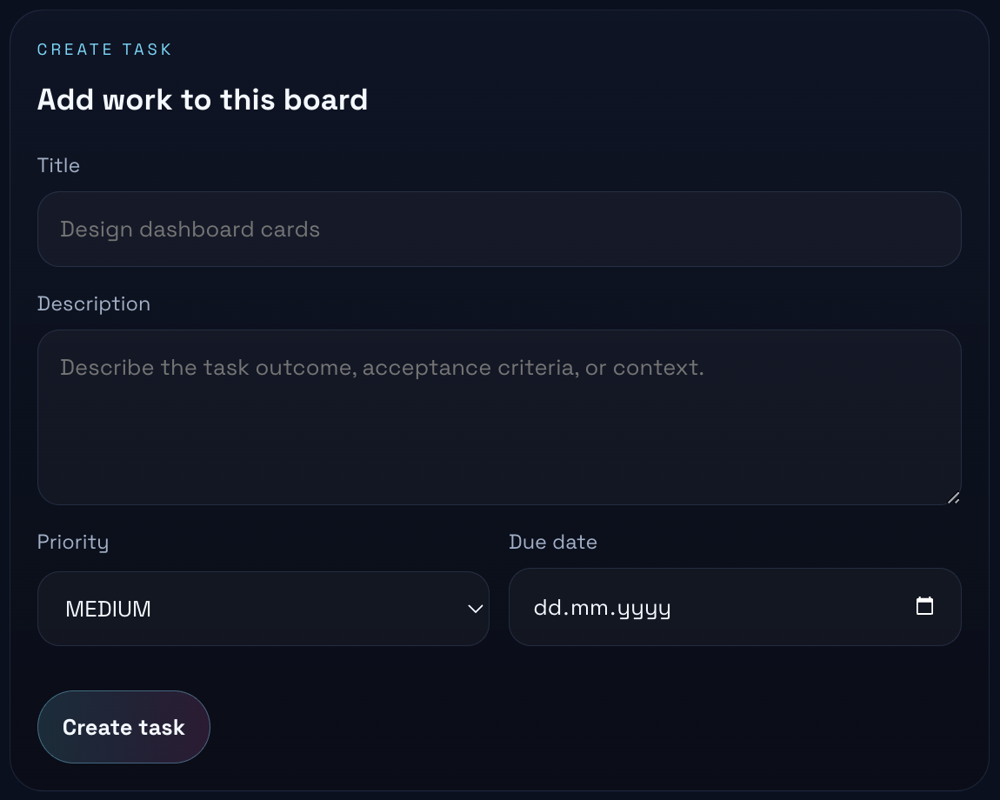
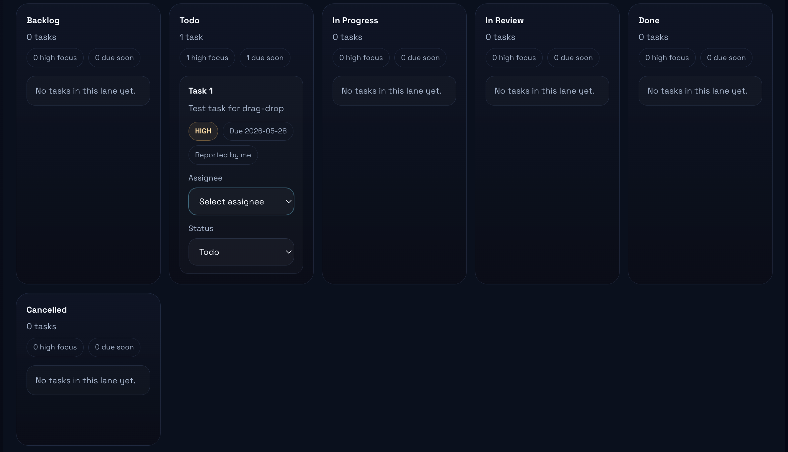

# TaskFlow Fullstack

## Overview

`taskflow-fullstack` is the flagship fullstack product in this portfolio ecosystem.

It is designed to show that the backend foundations proven in earlier Spring Boot projects can scale into a real product with:

- secure authentication
- project and task workflows
- board-based collaboration
- dashboard visibility
- live frontend-backend integration

## Product Positioning

TaskFlow is a compact project management platform inspired by lightweight Jira / Trello / Linear workflows.

The goal is not enterprise complexity.

The goal is to prove fullstack architecture, product thinking, and implementation quality in one recruiter-facing project.

## Current Status

`TaskFlow` is now a deployed portfolio flagship project.

Live demo:

- Frontend: https://task-flow-rho-steel.vercel.app
- Backend health: https://taskflow-backend-yosc.onrender.com/api/v1/auth/health

Demo account:

- Email: `demo.owner@taskflow.dev`
- Password: `Password1`

## Screenshots

### Dashboard



### Projects



### Kanban Board



### Task Creation



### Drag And Drop



## Demo Walkthrough

Use the demo account to review the main product flow:

1. Log in with `demo.owner@taskflow.dev` and `Password1`.
2. Review the dashboard summary and analytics panels.
3. Open the seeded project workspace.
4. Create or inspect tasks on the Kanban board.
5. Move tasks between lanes with drag and drop.
6. Try task filtering and assignee controls.

Working slices currently include:

- auth flow
- project creation
- project board navigation
- task creation
- task status updates
- assignee controls
- dashboard refresh and summary cards
- optional demo seed for recruiter walkthroughs
- deployed frontend, backend, and hosted PostgreSQL database

## Project Structure

```text
taskflow-fullstack/
├── backend/
└── frontend/
```

## Backend Highlights

- Spring Boot + Spring Security + JWT
- feature-based modules
- project, task, dashboard, and auth endpoints
- integration tests
- PostgreSQL-ready config with test-profile local verification

See:

- [backend/README.md](/Users/ruhatkaratas/Documents/Portfolio%20Website/taskflow-fullstack/backend/README.md:1)

## Frontend Highlights

- React + TypeScript + Vite
- protected routing and auth context
- live dashboard and project screens
- board filters, task creation, and assignee workflows
- dark workspace UI aligned with the portfolio’s visual direction

See:

- [frontend/README.md](/Users/ruhatkaratas/Documents/Portfolio%20Website/taskflow-fullstack/frontend/README.md:1)

## What This Project Proves

- end-to-end fullstack architecture
- React and Spring Boot integration
- JWT-secured application flows
- product-oriented UI thinking
- incremental engineering and verification discipline

## Next Steps

- add comments and activity history
- add richer dashboard metrics
- add a cleaner public demo reset strategy
